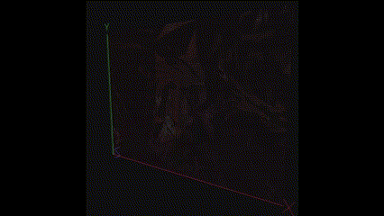

## Chromatik GST

This is a Chromatik package that provides a simple integration of the cross-platform [GStreamer](https://gstreamer.freedesktop.org/) library for audio and video processing.
GStreamer has the ability to perform hardware accelerated video decoding on various platforms.  Also, for CUDA-based systems, NVIDIA provides GStreamer pipeline components for
hardware accelerated machine learning inference so it is possible for example to split the pipeline where one video sink (destination) is used for display
and the other is used for pose detection, etc.

### Installation
- Download the latest release from the [releases page](https://github.com/tracyscott/ChromatikGST/releases)
- Install GStreamer from the [official website](https://gstreamer.freedesktop.org/download/)
- Make sure GStreamer binaries are in your system PATH.  The following command should pop up your webcam in window:
- `gst-launch-1.0 autovideosrc ! autovideosink`
- Drag and drop the JAR file into the Chromatik UI to install the package.

### Building

- Build with `mvn package`
- Install via `mvn install`

_Note that `mvn install` does **not** automatically copy static files from [`src/main/resources`](src/main/resources) into your root `~/Chromatik` folder. You can either perform this step manually, or by importing the package using the Chromatik UI._

### Patterns

#### GST
- Plays the media file ~/Chromatik/Video/chromatikgst.mp4

#### GSTAutoVideo
- Equivalent to autovideosrc in GStreamer. Automatically selects the best video source available, which should be a webcam or the videotestsrc if none available.

### TODO
- Add file chooser and rebuild pipeline on file selection.
- Allow for arbitrary pipeline creation with text based pipeline description. [GST Plugins](https://gstreamer.freedesktop.org/documentation/plugins_doc.html?gi-language=c)
